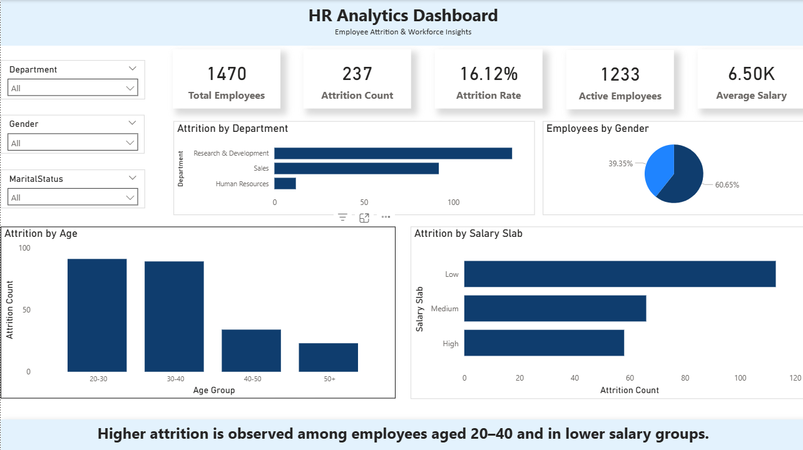

# HR Analytics Dashboard | Power BI

---

## Overview

This project presents an HR Analytics Dashboard developed using Power BI to analyze employee attrition, workforce distribution, and key performance metrics.

The dashboard helps identify factors influencing employee turnover and supports data-driven decision-making in human resource management.

---

## Business Problem

Employee attrition increases operational costs and impacts productivity. Organizations often struggle to identify the key drivers behind employee turnover due to lack of structured analysis.

This project addresses that challenge by providing a clear and interactive dashboard to monitor workforce trends and attrition patterns.

---

## Key Insights

- Higher attrition observed in specific departments
- Employees in lower salary ranges are more likely to leave
- Employees aged 20–40 show higher turnover
- Attrition trends vary across job roles and demographics

---

## Dashboard Features

- KPI metrics for workforce overview
- Attrition analysis by department, age group, and salary
- Interactive slicers for dynamic filtering
- Clean and structured layout for easy interpretation

---

## Tools and Technologies

- Power BI
- DAX
- Excel / CSV

---

## Project Structure

HR-Analytics-Dashboard/
│
├── data/
│ └── HR_Data.csv
│
├── dashboard/
│ └── HR_Analytics.pbix
│
├── reports/
│ ├── HR_Analytics_Dashboard_Report.pdf
│ └── HR_Analytics_Dashboard_Presentation.pptx
│
├── images/
│ └── dashboard.png
│
└── README.md

---

## Reports and Presentation

- Report: `reports/HR_Analytics_Dashboard_Report.pdf`
- Presentation: `reports/HR_Analytics_Dashboard_Presentation.pptx`

These documents provide detailed explanation of the analysis and findings.

---

## Dataset

IBM HR Analytics Employee Attrition Dataset (publicly available)

---

## Usage

1. Open the Power BI file located in the dashboard folder
2. Explore the dashboard using slicers and filters
3. Analyze workforce trends and attrition patterns

---

## Author

Krishna Bhise
